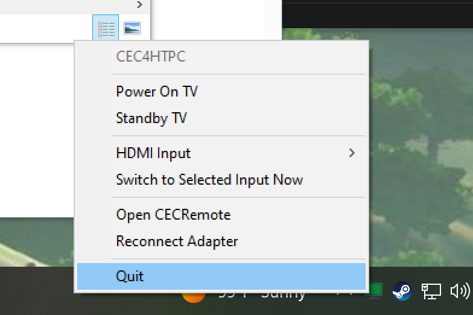
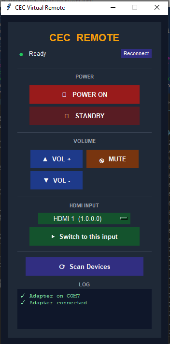

# CEC4HTPC (Windows)

**v1.0.0**

Headless CEC automation for Windows HTPC/Gaming machines. Runs as a system-tray app that starts with Windows and automatically controls your TV over HDMI-CEC using the [Pulse-Eight USB-CEC Adapter](https://www.pulse-eight.com/p/104/usb-hdmi-cec-adapter).

> [!WARNING]
> Every part of this project _HEAVILY_ used LLMs. This project is by no means perfect, but it works very well in my own testing*

---

## Features

| Feature | Description |
|---|---|
| **Startup** | Powers on the TV and switches to your configured HDMI input at login. (currently takes about 1min from power button press to boot and turn on the tv) |
| **Shutdown** | Standbys the TV when Windows shuts down. |
| **Sleep / Resume** | Standbys the TV on sleep; wakes it and reclaims the input on resume. (resume takes about 20-30s from button press) |
| **Volume Control** | Pins Windows master volume at 100%. Volume Up/Down/Mute key presses are intercepted and sent as CEC commands to the TV or soundbar instead. ⚠️ **WIP** — see [Known Issues](#known-issues). |
| **System Tray** | Right-click menu with quick power controls, per-port HDMI input selection, adapter reconnect, and a shortcut to the bundled CEC Virtual Remote for manual control. |

---

## Screenshots

| Tray Menu | CEC Virtual Remote |
|---|---|
|  |  |

---

## Requirements

- Windows 10 or 11
- Python 3.10+
- [Pulse-Eight USB-CEC Adapter](https://www.pulse-eight.com/p/104/usb-hdmi-cec-adapter) with drivers installed
  - Default install path: `C:\Program Files (x86)\Pulse-Eight\USB-CEC Adapter\`
- **Automatic Login MUST be enabled for any Wake functions to work** this script runs on user-login so it will not turn on the tv until it reaches the desktop

---

## Installation

### 1. Install Python dependencies

```
pip install -r requirements.txt
```

Or let `install.bat` do it automatically (see step 3).

### 2. Configure your HDMI input

Edit `config.json` and set `hdmi_input` to the physical address of the HDMI port your PC is connected to:

| Value | Port |
|---|---|
| `"1000"` | HDMI 1 |
| `"2000"` | HDMI 2 |
| `"3000"` | HDMI 3 |
| `"4000"` | HDMI 4 |

If the adapter itself is misreporting its own physical address (see
[Fixing an adapter that reports the wrong HDMI port](#fixing-an-adapter-that-reports-the-wrong-hdmi-port)
below), also set `adapter_hdmi_port` to the port it's actually plugged into.

The HDMI adapter can techincally be plugged into _any_ HDMI port on the TV, but it is reccomended to connect this In-Line with the HDMI of your PC's source.

### 3. Register the startup task

Run `install.bat` **as Administrator**. It will:
- Auto-detect `pythonw.exe`
- Install pip dependencies
- Generate `RunNow.bat`, a per-machine launcher with your resolved `pythonw.exe`/script paths baked in. This is used to Manually run the script for testing (gitignored — regenerate by re-running `install.bat` if you move the repo or change Python versions)
- Create a Task Scheduler task that launches CEC4HTPC silently 5 seconds after login (at highest privilege, so the volume key hook works even in elevated apps)

To remove the startup task later, run `uninstall.bat`.

### 4. Test it

```
pythonw cec4htpc.py
```

Or double-click the `RunNow.bat` generated by `install.bat`. A green TV icon will appear in the system tray.

---

## Configuration

All settings live in `config.json` (created automatically on first run if missing):

```json
{
  "hdmi_input": "2000",
  "adapter_hdmi_port": 1,
  "startup_delay_seconds": 5,
  "startup_retry_count": 5,
  "startup_retry_interval_seconds": 8,
  "power_on_at_startup": true,
  "standby_on_shutdown": true,
  "standby_on_sleep": true,
  "wake_on_resume": true,
  "lock_volume": true,
  "allow_tv_to_wake_pc": false
}
```

| Key | Default | Description |
|---|---|---|
| `hdmi_input` | `"2000"` | Physical address of your PC's HDMI port |
| `adapter_hdmi_port` | `1` | The physical TV port the CEC adapter itself is plugged into (1-4). Only needed if the adapter misreports its own port — see [below](#fixing-an-adapter-that-reports-the-wrong-hdmi-port). |
| `startup_delay_seconds` | `5` | Seconds to wait after login before acting (lets desktop settle) |
| `startup_retry_count` | `5` | How many times to re-assert the HDMI input on startup |
| `startup_retry_interval_seconds` | `8` | Seconds between each retry |
| `power_on_at_startup` | `true` | Toggle startup TV-on behaviour |
| `standby_on_shutdown` | `true` | Toggle shutdown standby |
| `standby_on_sleep` | `true` | Toggle sleep standby |
| `wake_on_resume` | `true` | Toggle resume wake |
| `lock_volume` | `true` | Toggle volume key interception and 100% lock |
| `allow_tv_to_wake_pc` | `false` | When `false` (default), CEC is disconnected before sleep so the adapter cannot fire a USB remote-wakeup when the TV is turned on by hand. Set `true` if you want the TV power button to wake the PC. ⚠️ **WIP** |

Changes to `config.json` take effect the next time CEC4HTPC starts. HDMI input can also be switched live from the tray menu.

---

## Known Issues

- **Volume control via keyboard/system volume buttons is WIP** and not yet reliable — it'll be fixed in the next major release. In the meantime, **volume control from the CEC Virtual Remote works great** and can be used at any time (VOL +/-, MUTE buttons in the tray's "Open CECRemote" window).

---

## Beating Aggressive Devices (Apple TV)

When your PC wakes up, an Apple TV (or similar device) on the same CEC bus may also wake and broadcast `ActiveSource`, stealing the TV's active input. CEC4HTPC counters this by repeatedly re-asserting its input after startup:

```
power on → wait 2.5 s → [switch input → wait N s] × retries
```

With the defaults (5 retries, 8 s apart) this asserts your input for ~40 seconds — long enough to outlast Apple TV's startup sequence. If Apple TV is still winning, increase `startup_retry_count` or decrease `startup_retry_interval_seconds`.

---

## Fixing an Adapter That Reports the Wrong HDMI Port

The Pulse-Eight adapter normally figures out its own physical HDMI address (which port it's plugged into) via EDID, the same way any HDMI device does. If it's sitting behind something that doesn't relay that correctly — an HDMI switch, splitter, or a receiver with its own EDID handling — that detection can fail silently, and the adapter always negotiates as **HDMI1** no matter which physical port it's actually wired to. That's what causes flip-flopping between "HDMI1" (the adapter/CEC-tester or an Apple TV that's really on HDMI1) and the port your PC is actually connected to.

`cec_controller.py` already avoids the worst symptom of this on its own: the startup/resume sequence never sends a raw `ActiveSource` from the adapter's own (wrong) address — it wakes the TV with a command addressed directly to the TV's logical address (`tv_on()`), then claims the input with a hand-built `ActiveSource` frame carrying the port from `hdmi_input` in `config.json`, not the adapter's self-detected one (see the comments in `startup_sequence()` in [cec_controller.py](cec_controller.py)).

But the adapter's own misreported address is still visible elsewhere — e.g. it'll show up as a device on HDMI1 in `cec-client`'s `scan` output or a CEC tester, which is confusing and can still cause contention with another real HDMI1 device (like an Apple TV) fighting over the same reported port.

`cec-client.exe` supports overriding this detection directly:

```
-p --port {int}   The HDMI port to use as active source.
-b --base {int}   The logical address of the device to which this adapter is connected.
```

CEC4HTPC exposes `-p` via the `adapter_hdmi_port` config key. Set it to the port the adapter is **physically** plugged into (regardless of what it currently reports), e.g.:

```json
{
  "hdmi_input": "3000",
  "adapter_hdmi_port": 3
}
```

This tells `cec-client.exe` to negotiate physical address `3.0.0.0` on connect instead of falling back to `1.0.0.0`. Restart CEC4HTPC (or use "Reconnect Adapter" from the tray menu) for it to take effect. `-b` (base device) isn't currently exposed since it only matters if the adapter is wired through an AVR/soundbar rather than straight into the TV; open an issue if you need it.

---

## File Overview

```
CEC4HTPC (windows)/
├── cec4htpc.py          # Main app — tray icon and orchestration
├── cec_controller.py    # Thread-safe CEC wrapper (persistent cec-client.exe subprocess)
├── power_monitor.py     # Win32 hidden window for sleep/resume/shutdown events
├── volume_hook.py       # Volume key hook (WH_KEYBOARD_LL) + Windows volume lock (pycaw)
├── virtual_remote.py    # Bundled CEC Virtual Remote (Tkinter GUI); shares the tray app's connection
├── logging_setup.py     # Rotating file logger shared by all modules
├── config.json          # User settings
├── requirements.txt     # pip dependencies
├── install.bat          # Register Task Scheduler startup task; generates RunNow.bat
├── uninstall.bat        # Remove startup task
└── RunNow.bat           # Generated by install.bat — per-machine manual launcher (gitignored)
```

---

## Logging & Troubleshooting

Every run appends to `cec4htpc.log` next to the script (rotated at 2 MB, 3 backups kept). It records connect/disconnect/reconnect attempts, every CEC command sent, raw `cec-client.exe` output, and every sleep/resume/shutdown event Windows sends — useful for diagnosing adapter/resume issues after the fact. The bundled CEC Virtual Remote's on-screen LOG panel also now timestamps entries and mirrors the adapter's live output.

Only one CEC4HTPC instance can run at a time — a second launch (e.g. a stray double-click) logs a warning and exits immediately rather than fighting the first instance over the adapter.

---

## Dependencies

| Package | Purpose |
|---|---|
| `pywin32` | Win32 API — hidden window, power events |
| `pystray` | System tray icon and menu |
| `Pillow` | Tray icon image generation |
| `keyboard` | Global `WH_KEYBOARD_LL` hook for volume key suppression |
| `pycaw` | Windows Core Audio API — master volume control |
| `comtypes` | COM interop (dependency of pycaw) |

---

## Related

- `virtual_remote.py` — Bundled CEC Virtual Remote; launched from the tray menu and shares the existing CEC connection. Can also be run standalone (`python virtual_remote.py`).
- [libcec / Pulse-Eight](https://github.com/Pulse-Eight/libcec) — underlying CEC library and `cec-client.exe`.

## LLM Use*

Everything here was written in some form by Claude, I have a light backround in coding, so I have done my best to structure this to be as simple and clean as possible. 
The primary purpose of this project is to make use of the fantastic adapter by PulseEight and do my best to make a tool to control my TV from my computer.
If someone wants to help improve this project or make a organic home grown replacement, I would be overjoyed. 
Thanks for reading!
